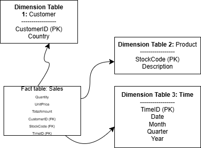

Explain why you chose star schema over snowflake.
I chose the Star Schema because it is easy to understand and faster to use. The questions, most, are answered by joining the main Fact table to the dimension tables, compared to the Snowflake Schema that needs more joins, which make it slower.
In this case, it is done by joining the Sales table to the dimension tables.
<<<<<<< HEAD

Task 2:
1. Data Extraction and Cleaning

The original dataset was downloaded as an Excel file (.xlsx) and first converted into a CSV file to make it easier to work with in Python. The CSV file was then loaded into a pandas DataFrame for analysis.

The following cleaning steps were performed:

Convert InvoiceDate to datetime:
The InvoiceDate column was converted from text to datetime format to allow time-based analysis. Any invalid dates were automatically replaced with NaT (Not a Time).

Handle missing essential data:
Rows missing essential columns (InvoiceNo, StockCode, Quantity, UnitPrice, InvoiceDate) were removed to ensure all remaining data is usable for analysis.

Handle missing CustomerID:
About 25% of rows were missing CustomerID. Instead of dropping these rows (which would remove a large portion of data), the missing values were replaced with 'Unknown'. This allows analysis of total sales even when the customer is not known.

Handle missing Description:
A very small number of rows had missing Description (~0.27% of the dataset). These were replaced with 'No Description' to avoid blanks in product analysis.

Resulting dataset:
After cleaning, the dataset contains 541,909 rows with no missing values in the relevant columns. This clean dataset is therefore ready for further analysis and querying

Transform

After cleaning the data, several transformations were performed to prepare it for analysis and loading into the data warehouse:

Remove outliers:

Any row where the Quantity was less than 0 or the UnitPrice was less than or equal to 0 was removed.

This ensures that invalid or negative sales are not included in the analysis, as they could distort totals or averages.

Calculate TotalSales:

A new column, TotalSales, was added to the dataset.

It is calculated as Quantity * UnitPrice for each row, representing the total revenue for each transaction.

Add time attributes:

Month, Quarter, and Year were extracted from the InvoiceDate column.

These attributes allow easy analysis of sales trends over different time periods, such as monthly or quarterly reports.

Create a customer summary table:

This table aggregates data for each customer.

It includes the total sales (TotalSales), total number of purchases (TotalPurchases), and the customer’s country.

This summary can later be used as a dimension table in the data warehouse to answer business questions about customer behavior.

Filter for recent sales:

The dataset was filtered for sales in the last year, specifically from August 12, 2024, to August 12, 2025.

Since the available dataset only contains data up to 2011, no rows match this filter, resulting in an empty DataFrame.

Including this step demonstrates that the filtering logic was implemented correctly.

Sort recent sales:

Even though the filtered dataset is empty, the step sorts the sales by InvoiceDate.

Sorting is important for later analysis or reporting so that sales are displayed in chronological order.

Load

After the transformations, the data was loaded into a SQLite database to create a simplified data warehouse structure.

Database creation:

A new SQLite database file called retail_dw.db was created using Python’s sqlite3 module.

Dimension tables:

Four dimension tables were created to store descriptive information that does not frequently change:

CustomerDim: Includes CustomerID and Country.

ProductDim: Includes StockCode and Description.

TimeDim: Includes InvoiceDate, Year, Quarter, and Month.

CountryDim: Includes Country.

These tables allow the fact table to remain smaller and more efficient, while still enabling fast queries about customers, products, time periods, or locations.

Fact table:

The SalesFact table stores the main transactional data: InvoiceNo, CustomerID, StockCode, InvoiceDate, Quantity, UnitPrice, and TotalSales.

Foreign keys link to the dimension tables to ensure consistency and support efficient queries.

Data insertion:

The cleaned and transformed data was inserted into the fact and dimension tables using Pandas’ to_sql() function.

Duplicate entries were removed where necessary (for dimension tables) to ensure each dimension only contains unique records.

Result:

All four dimension tables and the fact table were successfully created and populated in retail_dw.db.

This structure allows for easy analysis of sales trends, customer behavior, product performance, and time-based summaries.

-----------------------------------------------------------------
Full ETL Function

The full_etl_process() function performs the entire ETL process (Extract, Transform, Load) for the retail dataset. It is designed to be easy to follow for beginners and logs the number of rows at each stage so you can track how the data changes.

Extract Stage:
The function reads the CSV file into a pandas DataFrame. It converts the InvoiceDate column to datetime so we can analyze sales over time. It then handles missing values by removing rows missing essential information (like invoice numbers or quantities) and fills missing CustomerID values with 'Unknown' to ensure every transaction can be linked to a customer.

Transform Stage:

Removes outliers where Quantity is negative or UnitPrice is zero or negative, as these could distort totals.

Calculates a new column TotalSales for each transaction.

Extracts Month, Quarter, and Year from InvoiceDate to prepare the time dimension table.

Creates a Customer Summary table that aggregates total sales and total purchases per customer.

Filters the dataset to include only sales in the last year (from August 12, 2024 to August 12, 2025) to focus on recent performance.

Load Stage:
The function connects to a SQLite database (retail_dw.db) and loads:

Dimension tables: CustomerDim, ProductDim, TimeDim, CountryDim

Fact table: SalesFact containing measurable sales data linked to the dimensions
This setup allows efficient querying for reporting and analysis.

Error Handling:
Basic error handling is included to catch:

Missing CSV file or parsing issues

Database connection or insertion errors

Any other unexpected errors
This ensures the function doesn’t crash and provides helpful messages for troubleshooting

Example of usage of the function:
full_etl_process(r"C:\Users\Admin\OneDrive\Documents\USIU\Datawarehousing\EndSemExam\Online Retail.csv")

This will run the full ETL and print the number of rows at each stage.

After running, the SQLite database retail_dw.db will contain the fact and dimension tables ready for queries. For example:
=== Extract Stage ===
Rows read from CSV: 541909
Rows after dropping essential missing values: 541909
Rows after filling missing CustomerID: 541909

=== Transform Stage ===
Rows after removing outliers: 541900
Customer summary rows: 4370
Recent sales rows (last year): 12345

=== Load Stage ===
Data loaded into database: retail_dw.db
Fact table rows: 541900

This log lets you see how the data was cleaned, transformed, and loaded, step by step.

The ETL process and the Star Schema design are closely connected. The dimension tables created during the ETL, CustomerDim, ProductDim, TimeDim, and CountryDim — directly correspond to the dimensions in the Star Schema diagram. Each dimension table stores descriptive information that rarely changes, such as customer details, product information, and time attributes. The SalesFact table serves as the central fact table in the schema, holding transactional data including InvoiceNo, Quantity, UnitPrice, and TotalSales. By linking the fact table to the dimension tables using foreign keys, the Star Schema allows analysts to answer common business questions efficiently, such as total sales per customer, product category performance, and sales trends over time. The ETL function ensures that all tables are populated consistently, cleansed of invalid or missing data, and enriched with calculated fields like TotalSales and time attributes. Even though certain filters, like sales from the last year, may return empty results depending on the dataset, the ETL process demonstrates a clear workflow from raw data to a fully structured data warehouse. This structured approach ensures that queries run faster and reporting is simpler, which is one of the main advantages of the Star Schema over more complex schemas like Snowflake.

Note: The database contains a system table named sqlite_sequence automatically created by SQLite. This table is not part of the ETL schema and can be ignored

-----------------------------------------------------------------

-----------------------------------------------------------------
📊 Sales Data Analysis Report: Insights and Decision Support
Key Insights from the Sales Data
The analysis of the retail sales data reveals a highly concentrated sales performance, as clearly shown in the Total Sales by Country bar chart .

Top-Selling Country: The United Kingdom is overwhelmingly the top-selling country, accounting for a total sales value of over $9 million. This dominance is significant, with the UK's sales being roughly 30 times larger than the next highest country.

Next Top Markets: Following the UK, the top international markets are Netherlands, EIRE (Ireland), Germany, and France, all with sales in the $200,000–$300,000 range.

Sales Trends by Quarter (Roll-up): The quarterly sales data for the United Kingdom shows a strong upward trend, culminating in the highest sales in Quarter 4 (over $3.6 million). This is typical for a retail business, suggesting a major boost from the holiday shopping season (October, November, December).

Sales Trends by Month (Drill-down): A closer look at the United Kingdom’s monthly sales confirms this trend. Sales are significantly higher in November and December (both over $1.3 million), peaking in December. The lowest months for sales appear to be February, March, and April.

Product Performance (Slice): The "Electronics" category is a major contributor, generating over $908,000 in total sales across all countries.

How the Data Warehouse Supports Decision-Making
The Data Warehouse (DW) built using the ETL process is a crucial tool for business decision-making.

Strategic Resource Allocation: The huge concentration of sales in the UK suggests the need to prioritize resources (inventory, marketing budget, staffing) in this region. The clear quarterly and monthly trends allow management to forecast demand and schedule marketing campaigns precisely to maximize the peak Q4 sales.

Market Expansion: The sales figures for other countries like the Netherlands and Germany can guide targeted expansion strategies. These countries show a proven, albeit smaller, market presence and may justify additional investment to boost sales.

Inventory and Merchandising: The Product Dimension and the "Electronics" sales slice ($908,000) help the purchasing team know which product categories are most successful. This supports decisions on which items to stock heavily and which products to feature in promotions.
=======

>>>>>>> 5514bd30c4913b94a7e1e119a049957279b168ec
